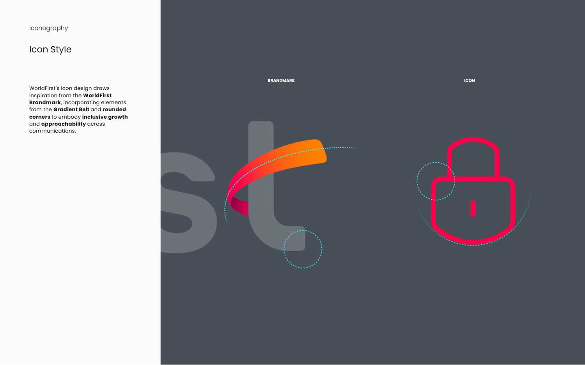
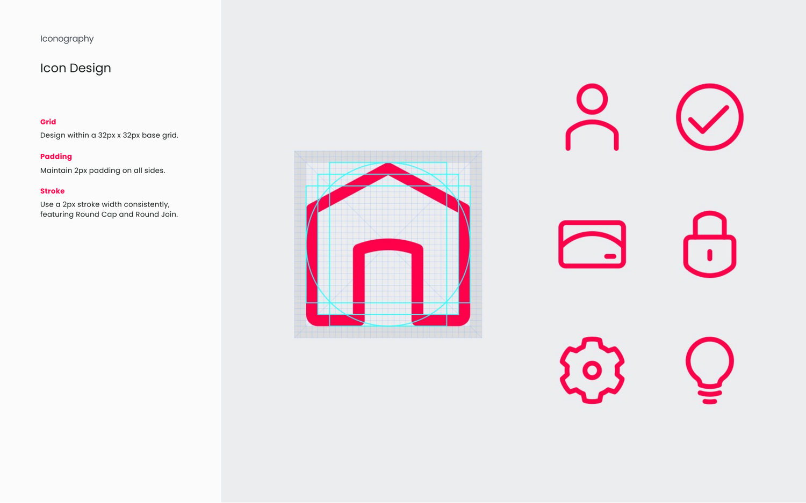
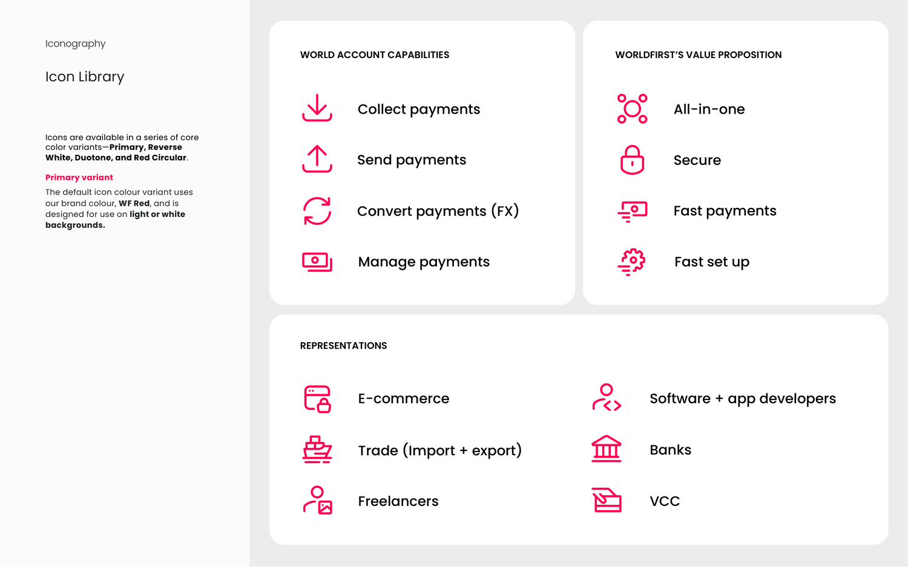
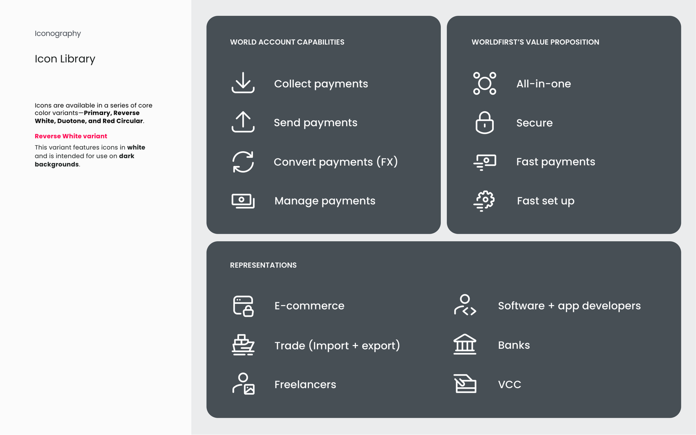
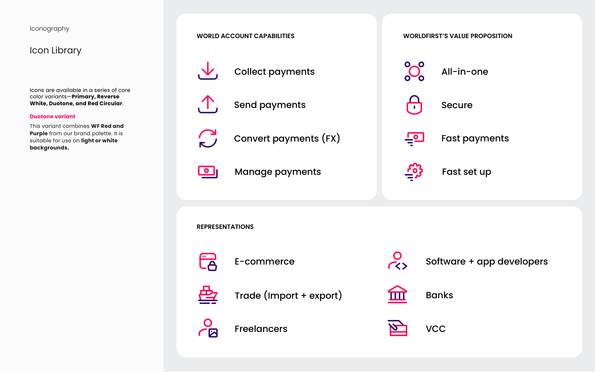
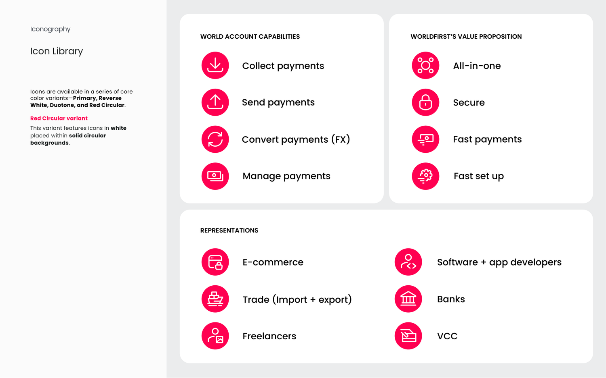

# Iconography guidelines (PDF, 7 pages)

Source: `guidelines/pdf/wf_iconography_guidelines.pdf` · 7 pages · extracted 2026-09-15

## Page 1

Iconography
• Icon Style
• Icon Design
• Icon Library

## Page 2

Iconography
Icon Style
WorldFirst’s icon design draws 
inspiration from the WorldFirst 
Brandmark, incorporating elements 
from the Gradient Belt and rounded 
corners to embody inclusive growth 
and approachability across 
communications.

## Page 3

Iconography
Icon Design
Grid
Design within a 32px x 32px base grid.
Padding
Maintain 2px padding on all sides.
Stroke
Use a 2px stroke width consistently, 
featuring Round Cap and Round Join.

## Page 4

Icon Library
Iconography
Icons are available in a series of core 
color variants—Primary, Reverse 
White, Duotone, and Red Circular.
Primary variant
The default icon colour variant uses 
our brand colour, WF Red, and is 
designed for use on light or white 
backgrounds.
WORLD ACCOUNT CAPABILITIES
REPRESENTATIONS
WORLDFIRST’S VALUE PROPOSITION
Collect payments
Send payments
Convert payments (FX)
Manage payments
All-in-one
Secure
Fast payments
Fast set up
E-commerce
Trade (Import + export)
Freelancers
Software + app developers
Banks
VCC

## Page 5

Icon Library
Iconography
WORLD ACCOUNT CAPABILITIES
REPRESENTATIONS
WORLDFIRST’S VALUE PROPOSITION
Collect payments
Send payments
Convert payments (FX)
Manage payments
All-in-one
Secure
Fast payments
Fast set up
E-commerce
Trade (Import + export)
Freelancers
Software + app developers
Banks
VCC
Icons are available in a series of core 
color variants—Primary, Reverse 
White, Duotone, and Red Circular.
Reverse White variant
This variant features icons in white
and is intended for use on dark 
backgrounds.

## Page 6

Icon Library
Iconography
WORLD ACCOUNT CAPABILITIES
REPRESENTATIONS
WORLDFIRST’S VALUE PROPOSITION
Collect payments
Send payments
Convert payments (FX)
Manage payments
All-in-one
Secure
Fast payments
Fast set up
E-commerce
Trade (Import + export)
Freelancers
Software + app developers
Banks
VCC
Icons are available in a series of core 
color variants—Primary, Reverse 
White, Duotone, and Red Circular.
Duotone variant
This variant combines WF Red and 
Purple from our brand palette. It is 
suitable for use on light or white 
backgrounds.

## Page 7

Icon Library
Iconography
WORLD ACCOUNT CAPABILITIES
REPRESENTATIONS
WORLDFIRST’S VALUE PROPOSITION
Collect payments
Send payments
Convert payments (FX)
Manage payments
All-in-one
Secure
Fast payments
Fast set up
E-commerce
Trade (Import + export)
Freelancers
Software + app developers
Banks
VCC
Icons are available in a series of core 
color variants—Primary, Reverse 
White, Duotone, and Red Circular.
Red Circular variant
This variant features icons in white
placed within solid circular 
backgrounds.
