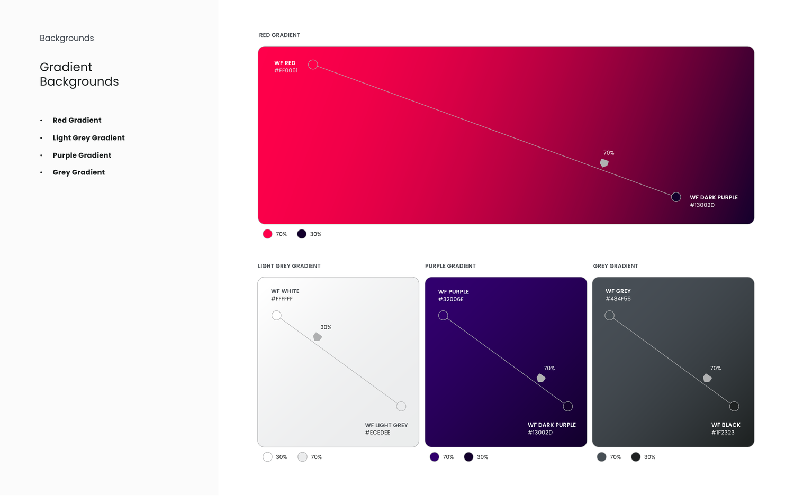
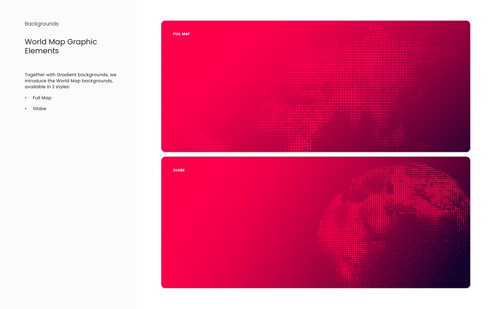
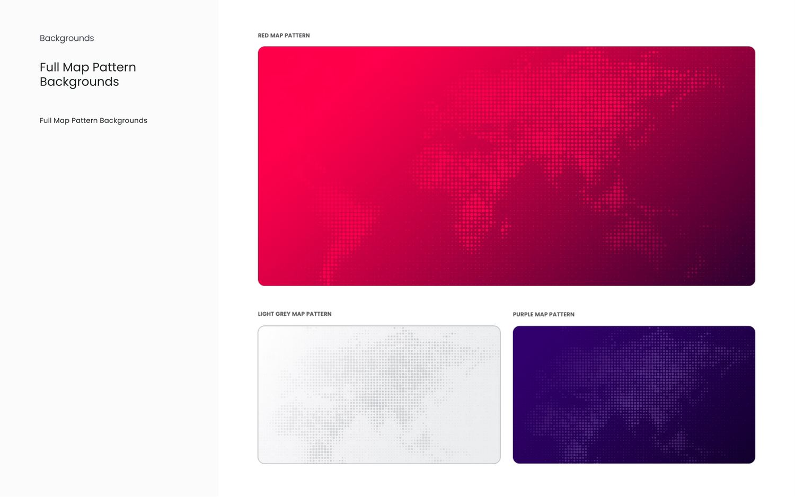
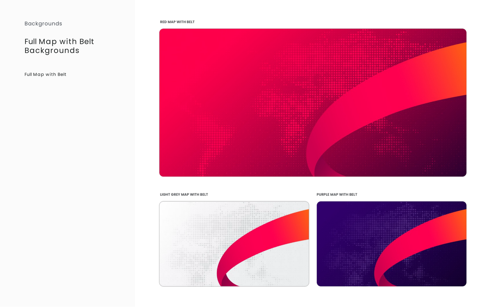
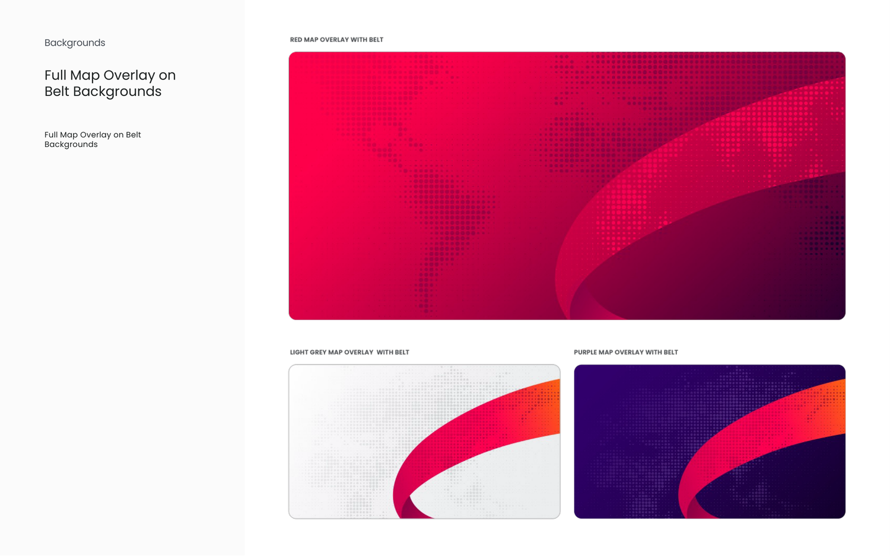
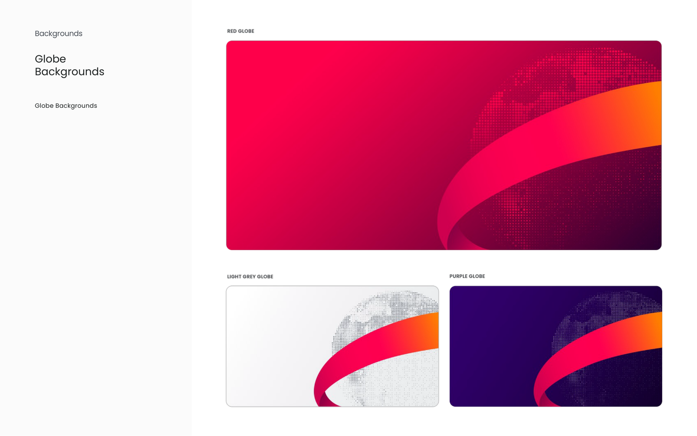
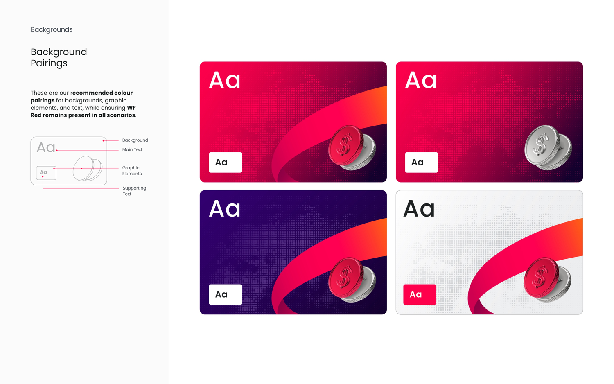
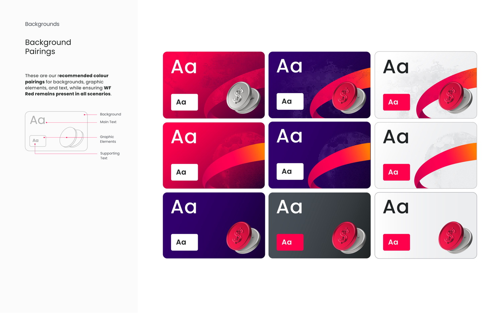
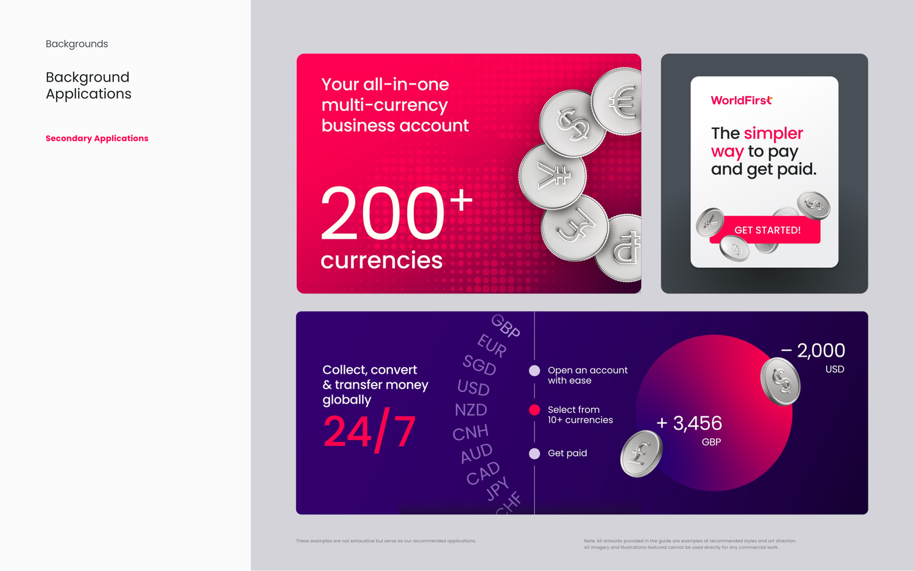

# KV world map, backgrounds and pairings guidelines (PDF, 13 pages)

Source: `guidelines/pdf/wf_pattern_guidelines.pdf` · 13 pages · extracted 2026-09-15

## Page 1

KV World Map
• Introduction
• Gradient Backgrounds
• World Map Graphic Elements
• Full Map with Belt Backgrounds
• Full Map Overlay on Belt Backgrounds
• Full Map Pattern Backgrounds
• Globe Backgrounds

## Page 2

Backgrounds
Introduction
Setting the Stage
•
WF Red
•
World Map
•
Belt

## Page 3

Backgrounds
Gradient 
Backgrounds
•
Red Gradient
•
Light Grey Gradient
•
Purple Gradient
•
Grey Gradient
70%
30%
WF RED
#FF0051
RED GRADIENT
70%
30%
WF BLACK
#1F2323
WF GREY
#484F56
GREY GRADIENT
70%
30%
WF WHITE
#FFFFFF
LIGHT GREY GRADIENT
WF LIGHT GREY
#ECEDEE
70%
30%
WF PURPLE 
#32006E
WF DARK PURPLE
#13002D
PURPLE GRADIENT
70%
70%
30%
WF DARK PURPLE
#13002D
70%

## Page 4

World Map Graphic 
Elements
Together with Gradient backgrounds, we 
introduce the World Map backgrounds, 
available in 2 styles:
•
Full Map
•
Globe
Backgrounds

## Page 5

Full Map Pattern 
Backgrounds
Full Map Pattern Backgrounds
Backgrounds

## Page 6

Full Map with Belt 
Backgrounds
Full Map with Belt
Backgrounds

## Page 7

Full Map Overlay on 
Belt Backgrounds
Full Map Overlay on Belt
Backgrounds
Backgrounds

## Page 8

Globe 
Backgrounds
Globe Backgrounds
Backgrounds

## Page 9

Background 
Pairings
These are our recommended colour 
pairings for backgrounds, graphic 
elements, and text, while ensuring WF 
Red remains present in all scenarios.
Aa
Supporting 
Text
Background
Main Text
Graphic 
Elements
Aa
Backgrounds

## Page 10

Background 
Pairings
These are our recommended colour 
pairings for backgrounds, graphic 
elements, and text, while ensuring WF 
Red remains present in all scenarios.
Aa
Supporting 
Text
Background
Main Text
Graphic 
Elements
Aa
Backgrounds

## Page 11

Primary Applications
Backgrounds
Background 
Applications

## Page 12

Primary Applications
Backgrounds
Background 
Applications

## Page 13

Backgrounds
Background 
Applications
Secondary Applications
