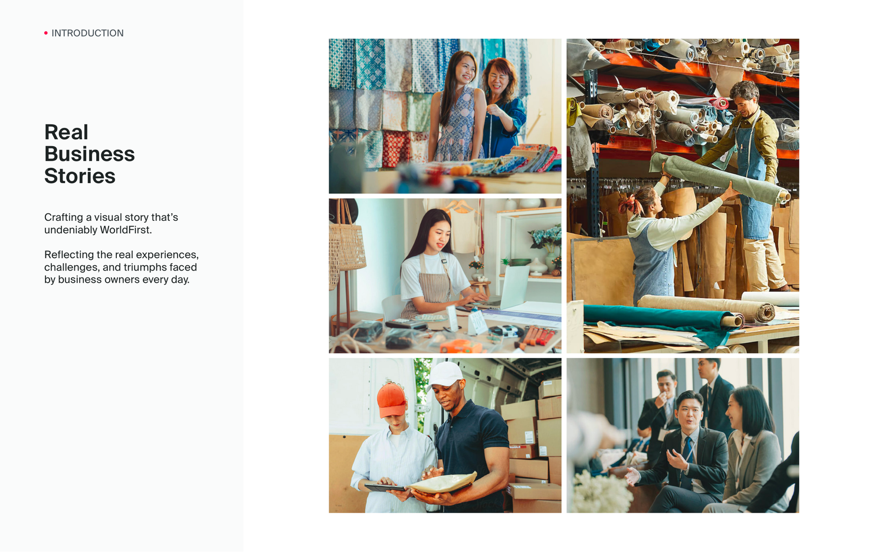
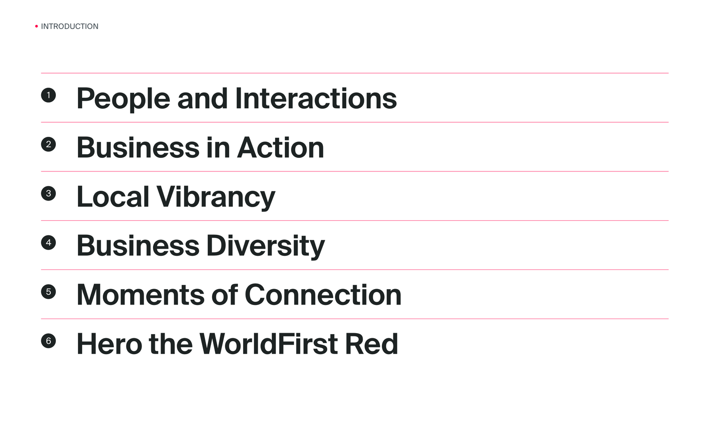
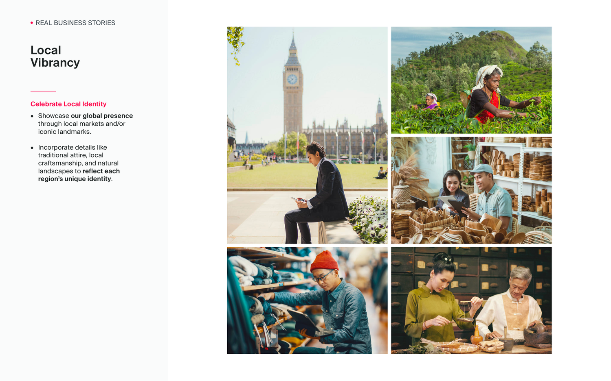
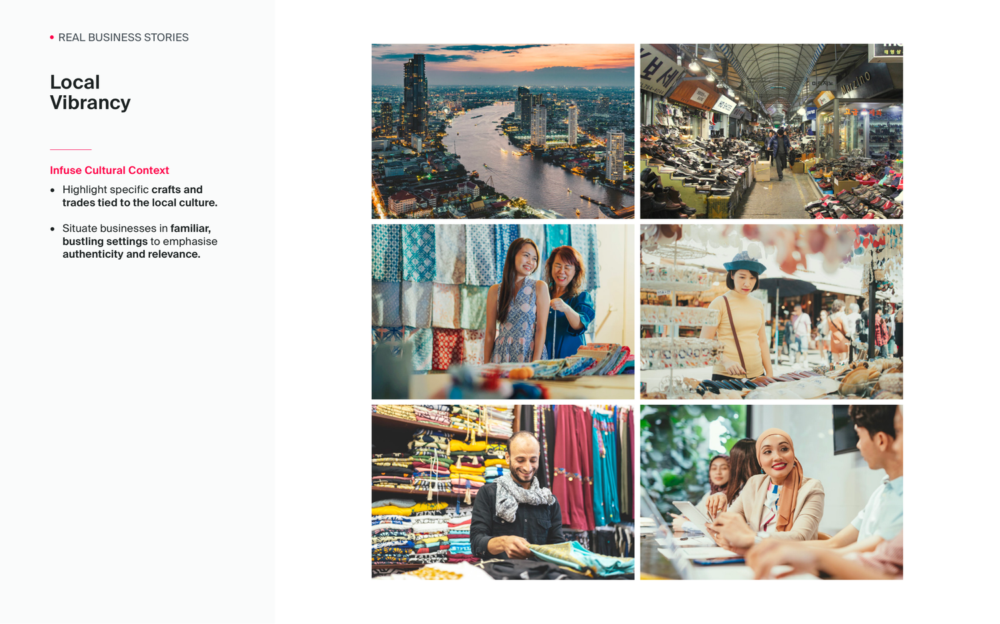

# Brand photography guidelines v02, Jan 2025 (PDF, 14 pages)

Source: `guidelines/pdf/wf_photography_guidelines.pdf` · 14 pages · extracted 2026-09-15

## Page 1

Brand Photography
Guidelines
VERSION – 02 JAN 2025

## Page 2

Real 
Business 
Stories
INTRODUCTION
Crafting a visual story that’s 
undeniably WorldFirst.
Reflecting the real experiences, 
challenges, and triumphs faced 
by business owners every day.

## Page 3

INTRODUCTION
People and Interactions
1
Business in Action
2
Local Vibrancy
3
Business Diversity
4
Moments of Connection
5
Hero the WorldFirst Red
6

## Page 4

Show Authenticity
• Feature real people with genuine 
expressions and natural poses 
that exude positive energy.
People and 
Interactions
REAL BUSINESS STORIES

## Page 5

Lighting and Tonal Consistency
• Use warm, natural lighting to 
create an inviting atmosphere.
• Avoid high-contrast or overly 
saturated tones. Aim for warm hues.
People and 
Interactions
REAL BUSINESS STORIES

## Page 6

Showcase Everyday
Drive and Passion
• Capture relatable, everyday 
business operations in 
authentic environments.
• Consider focusing on moments 
such as packing, inventory 
checks, stock replenishment, 
and deliveries.
Business 
in Action
REAL BUSINESS STORIES

## Page 7

Balance Scale with Detail
• Incorporate zoomed-out shots 
that capture the scale and 
reach, along with nuances of 
success and daily challenges.
• Use perspective and 
interesting crops to create 
dynamic shots of tasks.
Business 
in Action
REAL BUSINESS STORIES

## Page 8

Celebrate Local Identity
• Showcase our global presence 
through local markets and/or 
iconic landmarks. 
• Incorporate details like 
traditional attire, local 
craftsmanship, and natural 
landscapes to reflect each 
region’s unique identity.
Local 
Vibrancy
REAL BUSINESS STORIES

## Page 9

Infuse Cultural Context
• Highlight specific crafts and 
trades tied to the local culture.
• Situate businesses in familiar, 
bustling settings to emphasise 
authenticity and relevance.
Local 
Vibrancy
REAL BUSINESS STORIES

## Page 10

The World of Everyday Business
Represent the wide spectrum 
of businesses we serve:
• Small trading shops and 
generational businesses 
connecting globally
• E-commerce merchants 
both big and small
• International agencies and 
enterprises expanding 
their reach
Business 
Diversity
REAL BUSINESS STORIES

## Page 11

Business 
Diversity
REAL BUSINESS STORIES

## Page 12

Building Genuine Relationships
• Showcase authentic interactions, 
from team collaboration to 
meaningful customer exchanges.
• Convey empathy through 
guiding gestures, shared smiles 
or engaged dialogue.
Moments of 
Connection
REAL BUSINESS STORIES

## Page 13

A Distinct Brand Signature
• Our flagship colour establishes 
our unique identity and presence. 
• Integrated thoughtfully, it 
becomes a subtle visual cue 
that unites our brand story.
• Consider this direction when 
using a photo as a key visual.
Hero the
WorldFirst Red
REAL BUSINESS STORIES

## Page 14

www.worldfirst.com
Building a strong and distinctive brand 
is a collaborative effort. Feel free 
reach out to our WorldFirst Global 
Brand Team if you require assistance 
or ideas on improving the guide.
VERSION – 02 JAN 2025
© WORLDFIRST
As future decisions are made about 
brand usage, these guidelines will evolve. 
Please be sure to access the latest version 
of this Brand Photography Guidelines.
